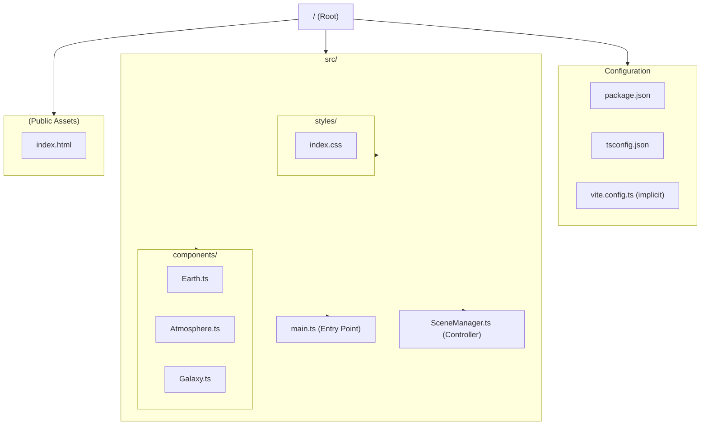

# Project Architecture & Flow

## 1. Directory Structure



## 2. Application Logic Flow

```mermaid
graph TD
    %% Entry Point
    Entry([main.ts]) -->|Imports & Initializes| SM[SceneManager.ts]
    Entry -->|Imports| CSS[index.css]

    %% Scene Manager Logic
    subgraph Manager [SceneManager Integration]
        direction TB
        SM -->|1. Init Three.js| Core[Scene, Camera, Renderer]
        SM -->|2. Setup Controls| Helpers[OrbitControls & Lights]
        
        %% Component Creation
        SM -->|3. Create Env| Galaxy[createGalaxy]
        Galaxy -.->|Return Points| S_Scene[Scene]
        
        SM -->|4. Create Earth| EarthFunc[createEarth]
        EarthFunc -->|Load Textures| Assets[Remote Assets (jpg/png)]
        EarthFunc -->|Return Group| EarthObj[Earth Group {Mesh, Clouds}]
        EarthObj -.->|Add to| S_Scene
        
        SM -->|5. Create Atmosphere| AtmoFunc[createAtmosphere]
        AtmoFunc -->|Return Mesh| AtmoMesh[Atmosphere GLSL Shader]
        AtmoMesh -.->|Add to| S_Scene
    end

    %% Rendering Loop
    subgraph Loop [Render Loop]
        Animate[animate()]
        Rot[Rotate Earth/Clouds]
        Update[Update Controls]
        Render[Renderer.render]
        
        SM -->|Start| Animate
        Animate --> Rot
        Animate --> Update
        Animate --> Render
        Render -.->|RequestAnimationFrame| Animate
    end
    
    %% Styling
    style Entry fill:#f9f,stroke:#333,stroke-width:2px
    style SM fill:#bbf,stroke:#333,stroke-width:2px
    style Assets fill:#ff9,stroke:#333,stroke-width:1px,stroke-dasharray: 5 5
```
